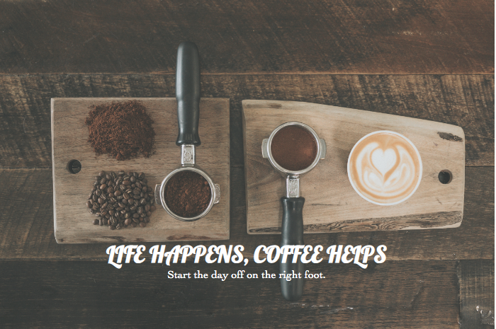
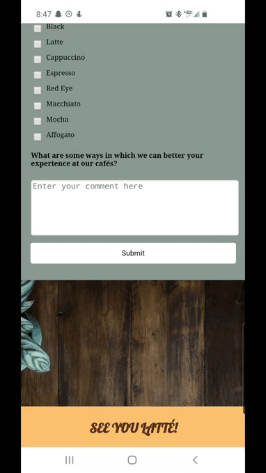

# Coffee Survey Form   

**HTML5, CSS3**

A mobile-first approach to a responsive, sample survey form built with product facts, a comprehensive questionnaire for consumers, and end video. Users who wish to fill this survey must include their name and email in the text box area and can also select answers from a drop-down menu, radio buttons, and/or checkboxes.

---

## Project Highlights

Project Section | Features
------------ | -------------
[Header](#Header) | Responsive header image with text overlay. 
[Main: Survey](#Main) | Flexbox design over comprehensive questionnaire. Users are able to input text in textbox area, select from a dropdown menu, radio options, and mark checkboxes that apply, then submit their information.
[Footer](#Footer) | Video outros survey form for users.

## Header

## Main

## Footer

---

## Contributors

Dany Chheang dany.chheang@gmail.com
